1. 首先分析mm_init函数的功能：

   - 这是内存管理系统的初始化函数
   - 主要完成物理内存池的初始化和内存分配器的设置
2. 函数主要流程：

   - 初始化物理内存映射表
   - 解析内存映射信息
   - 计算可用内存区域
   - 初始化buddy分配器管理物理内存
   - 初始化slab分配器管理小内存区域
3. 关键数据结构：

   - global_mem_pool: 全局物理内存池
   - physmem_map: 物理内存映射表
   - struct page: 页面元数据结构
4. 需要解释的重点：

   - 内存映射解析过程
   - 虚拟地址和物理地址转换
   - buddy和slab分配器的初始化关系
   - 内存区域计算逻辑

以下是mm_init函数的详细解释：

1. 函数功能：
   mm_init()是ArmDax9OS内存管理子系统的核心初始化函数，负责建立物理内存管理框架，初始化buddy和slab两种内存分配器。
2. 主要变量：

- free_mem_start/free_mem_end: 可用内存区域的起止虚拟地址
- page_meta_start: 页面元数据起始地址
- npages: 可用页面数量
- start_vaddr: 实际可用内存起始虚拟地址

3. 执行流程：

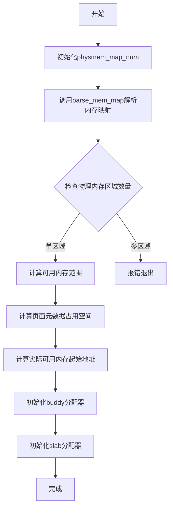

4. 关键代码段说明：

- 第19-20行: 初始化内存映射表并解析系统内存布局
- 第22-48行:
  - 计算可用内存区域(free_mem_start到free_mem_end)
  - 计算页面元数据占用空间(npages * sizeof(struct page))
  - 对齐实际可用内存起始地址(PAGE_SIZE对齐)
  - 初始化buddy分配器管理物理页面
- 第51行: 初始化slab分配器用于小内存分配

5. 内存布局关系：

```
+---------------------+
| 页面元数据          |
| (struct page数组)   |
+---------------------+
| 对齐填充区域        |
+---------------------+
| 实际可用内存区域    |
+---------------------+
```

6. 设计要点：

- 使用buddy系统管理物理页面大块分配
- 使用slab系统优化小内存分配效率
- 内存映射信息由平台相关代码(parse_mem_map)提供
- 支持单物理内存区域的简单情况

需要我生成更详细的Mermaid流程图吗？或者您希望对某个特定部分进行更深入的解释？

1. 首先分析page结构中的slab指针作用：

   - 在buddy.h中，struct page的slab成员是一个void*指针
   - 结合slab.c和buddy.c代码分析，这个指针用于标记该页面是否被slab分配器使用
   - 当页面被slab分配器使用时，slab指针指向对应的slab控制结构
   - 当页面由buddy系统管理时，slab指针为NULL
2. 需要创建的图表：

   - 伙伴系统初始化流程图
   - slab分配器初始化流程图
   - buddy_alloc_pages关键函数流程图
   - slab_alloc关键函数流程图
3. 图表设计要点：

   - 展示内存管理层次关系
   - 突出buddy和slab的协作
   - 显示关键数据结构和算法流程

以下是详细解释和图表：

1. page->slab指针的作用：

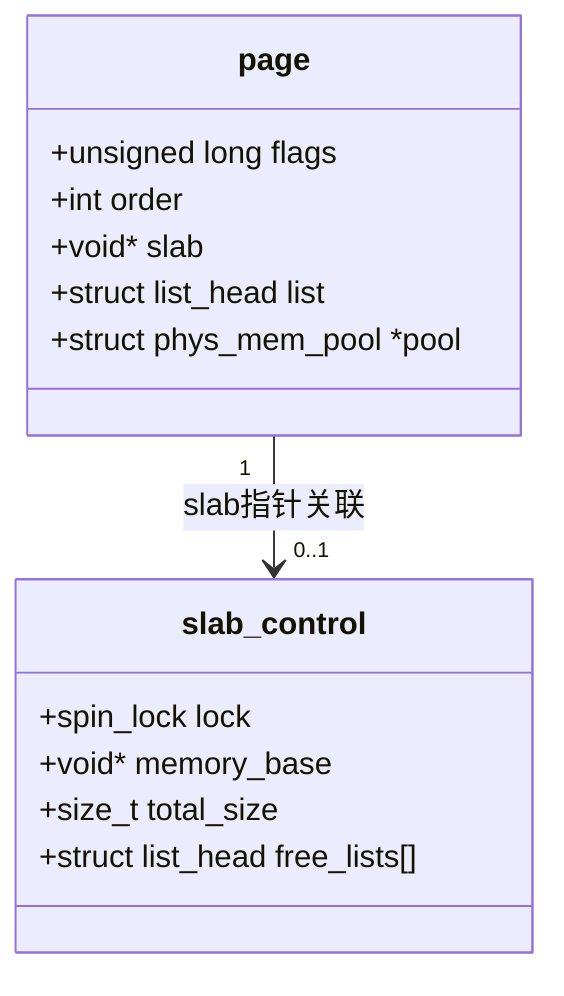

- 当页面由buddy系统管理时，slab = NULL
- 当页面被slab分配器使用时，slab指向对应的slab控制块
- 这样设计可以实现：
  - 快速判断页面归属(buddy/slab)
  - slab回收时能快速找到控制结构
  - 避免两种分配器间的冲突

2. 伙伴系统初始化流程图：

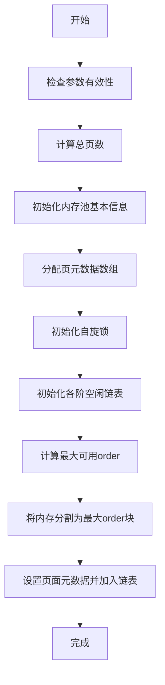

3. slab分配器初始化流程图：

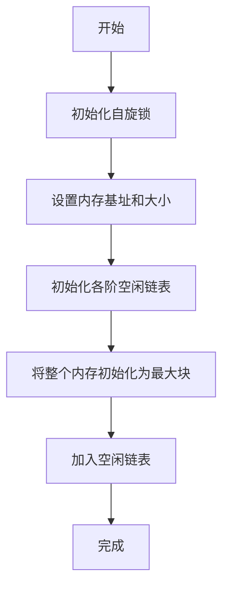

4. buddy_alloc_pages关键函数流程图：

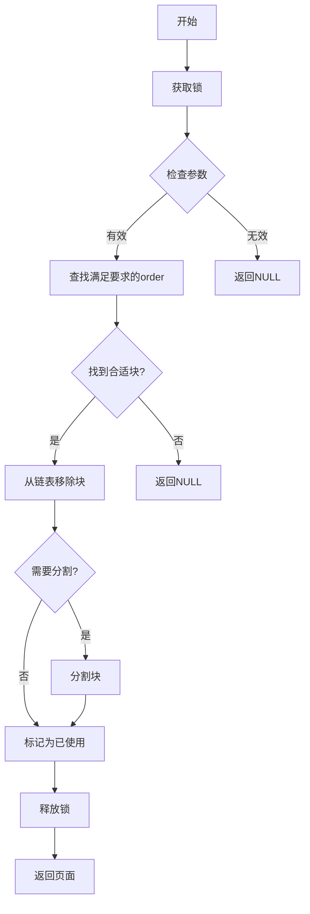

5. slab_alloc关键函数流程图：

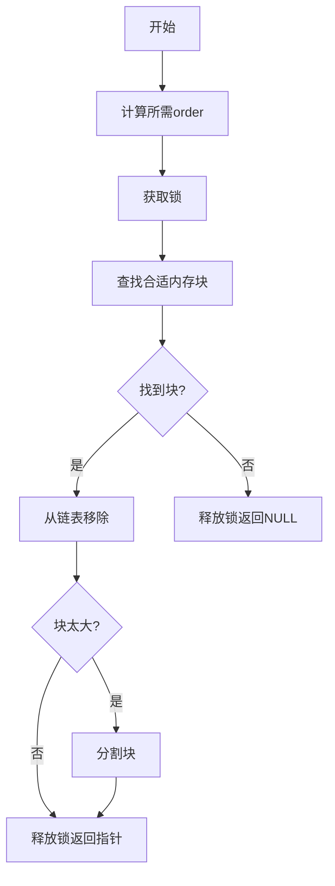

这些图表展示了：

1. 内存管理系统的层次结构
2. 关键数据结构的关联关系
3. 核心算法的执行流程
4. buddy和slab分配器的协作方式

page->slab指针的设计使得：

- 可以高效判断页面归属
- slab分配器能快速找到管理结构
- 两种分配器能协同工作而不冲突

虚拟内存管理内容：

1. 首先需要分析三个文件的内容和关系：

   - page_table.h 定义了页表相关的数据结构(pte_t/ptp_t)和宏定义
   - mm.h 提供了内存管理的基本定义和接口
   - page_table.c 实现了具体的页表操作函数
2. 任务要求：

   - 基于page_table.h和mm.h解释page_table.c中的每个函数
   - 为每个函数生成Mermaid流程图
3. 计划步骤：

   - 首先分析page_table.c中的函数列表
   - 对每个函数：
     * 分析函数功能
     * 解释关键代码逻辑
     * 绘制Mermaid流程图
   - 按函数顺序逐个完成
4. 需要特别注意：

   - 页表层级结构(L0-L3)
   - 页表项(PTE)的标志位设置
   - 地址转换过程
   - 大页映射处理

我将从第一个函数开始分析：

### 1. set_page_table 函数

**功能**：设置页表基地址寄存器(TTBR0_EL1)

**代码解释**：

```c
void set_page_table(paddr_t pgtbl)
{
        set_ttbr0_el1(pgtbl);
}
```

- 调用外部函数 `set_ttbr0_el1`设置页表基地址
- 参数 `pgtbl`是物理地址

**Mermaid流程图**：

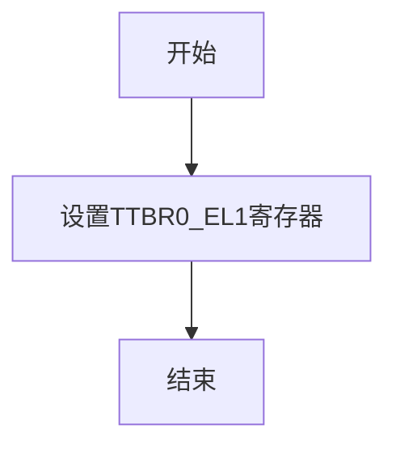

### 2. set_pte_flags 函数

**功能**：设置页表项(PTE)的标志位

**代码解释**：

- 根据 `flags`参数设置页表项的访问权限、执行权限、内存类型等属性
- 主要处理L3页表项(l3_page结构体)
- 支持设置：读写权限(AP)、执行权限(UXN/PXN)、内存类型(attr_index)等

**Mermaid流程图**：

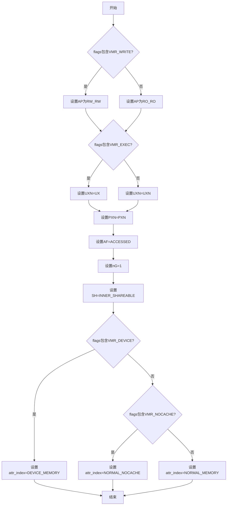

1. 接下来分析get_next_ptp函数，这是页表操作的核心函数之一
2. 需要重点关注：
   - 页表层级遍历逻辑(L0-L3)
   - 页表项分配机制
   - 返回状态处理(NORMAL_PTP/BLOCK_PTP)
3. 需要结合page_table.h中的宏定义和数据结构来理解

### 3. get_next_ptp 函数

**功能**：根据虚拟地址查找或分配下一级页表

**代码解释**：

- 参数：

  - cur_ptp: 当前页表页指针
  - level: 当前页表层级(0-3)
  - va: 虚拟地址
  - next_ptp: 返回下一级页表指针
  - pte: 返回指向下一级页表的PTE指针
  - alloc: 是否在缺失时分配新页表
- 关键逻辑：

  1. 根据level和va计算页表项索引
  2. 检查当前PTE是否有效
  3. 如果无效且alloc为true，分配新页表页
  4. 返回下一级页表信息和状态

**Mermaid流程图**：

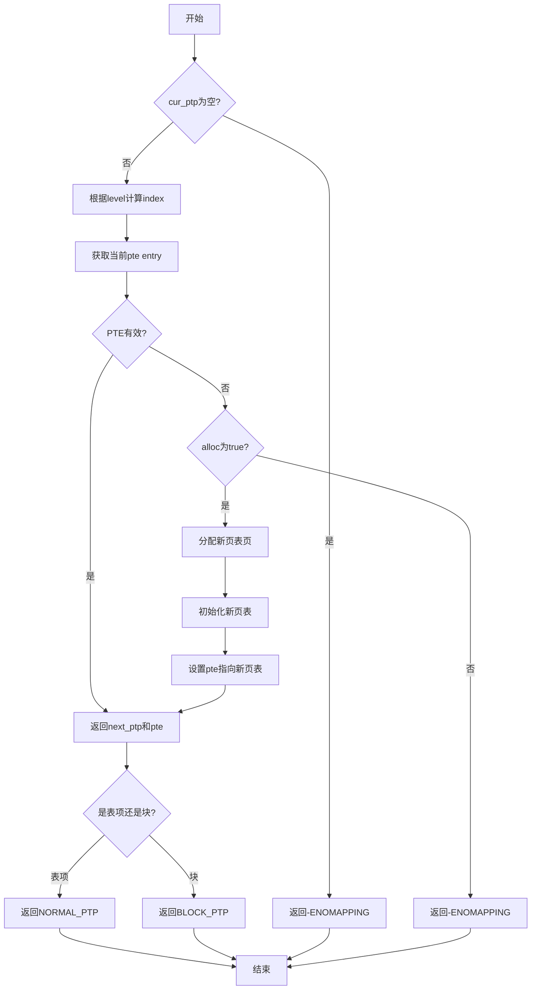

1. 接下来分析free_page_table函数，这是页表释放的核心函数
2. 需要重点关注：
   - 多级页表的递归释放逻辑
   - 页表层级遍历顺序(L0→L1→L2→L3)
   - 物理页面的释放机制
3. 需要结合page_table.h中的ptp_t结构体来理解

### 4. free_page_table 函数

**功能**：递归释放整个页表占用的物理内存

**代码解释**：

- 参数：

  - pgtbl: 要释放的页表根指针
- 关键逻辑：

  1. 检查输入参数有效性
  2. 四层循环遍历页表层级：
     - L0→L1→L2→L3
  3. 从最底层(L3)开始向上释放
  4. 使用free_pages释放物理页面

**Mermaid流程图**：

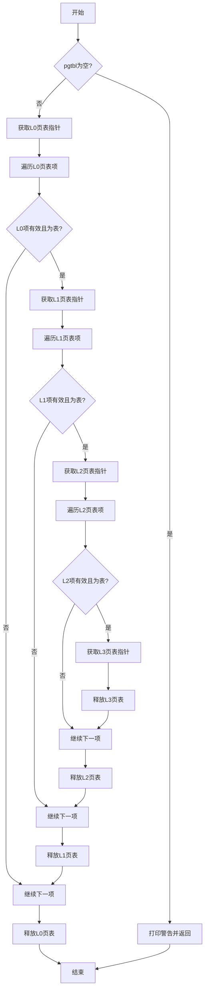

1. 接下来分析query_in_pgtbl函数，这是页表查询的核心函数
2. 需要重点关注：
   - 页表遍历过程
   - 虚拟地址到物理地址的转换逻辑
   - 错误处理机制
3. 需要结合page_table.h中的地址转换宏来理解

### 5. query_in_pgtbl 函数

**功能**：查询虚拟地址对应的物理地址和页表项

**代码解释**：

- 参数：

  - pgtbl: 页表根指针
  - va: 要查询的虚拟地址
  - pa: 返回物理地址
  - entry: 返回对应的页表项指针
- 关键逻辑：

  1. 从L0开始逐级查询页表
  2. 使用get_next_ptp获取下一级页表
  3. 计算最终物理地址(基地址+偏移量)
  4. 返回查询结果和页表项

**Mermaid流程图**：

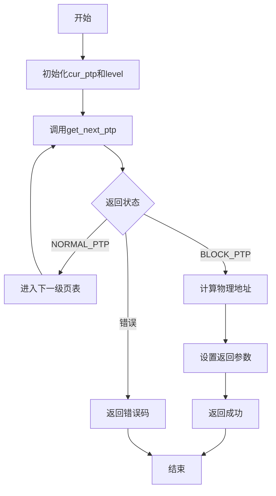

1. 接下来分析map_range_in_pgtbl函数，这是内存映射的核心函数
2. 需要重点关注：
   - 页表项的创建过程
   - 多级页表的填充逻辑
   - 物理地址到虚拟地址的映射关系
3. 需要结合set_pte_flags函数来理解属性设置

### 6. map_range_in_pgtbl 函数

**功能**：建立虚拟地址到物理地址的映射关系

**代码解释**：

- 参数：

  - pgtbl: 页表根指针
  - va: 起始虚拟地址
  - pa: 起始物理地址
  - len: 映射长度
  - flags: 内存属性标志
- 关键逻辑：

  1. 按页大小(PAGE_SIZE)循环处理
  2. 使用get_next_ptp获取页表项
  3. 在L3页表创建最终映射项
  4. 设置页表项属性和物理帧号

**Mermaid流程图**：

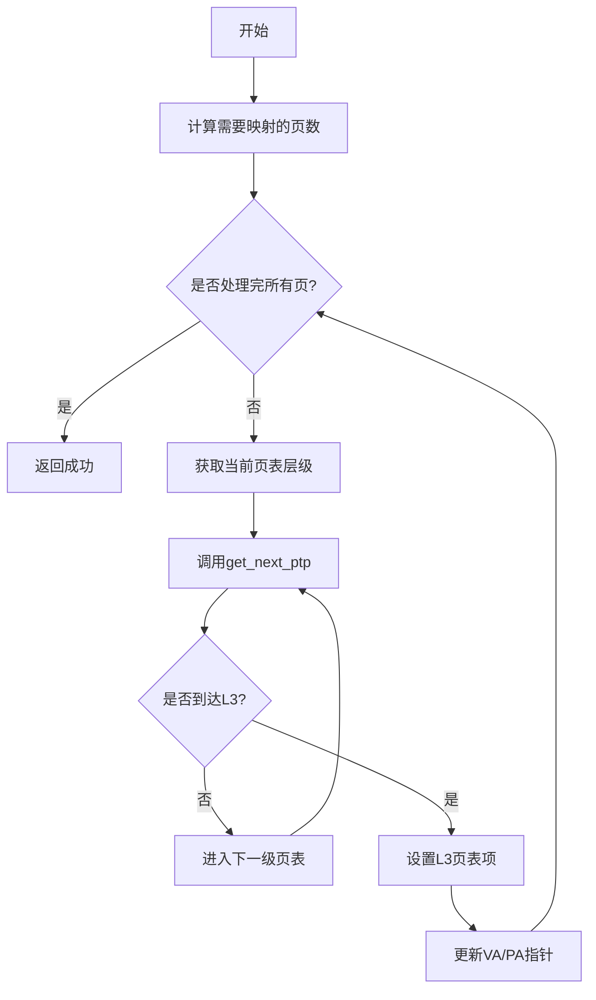

1. 接下来分析unmap_range_in_pgtbl函数，这是内存取消映射的核心函数
2. 需要重点关注：
   - 页表项的清除逻辑
   - 与map_range_in_pgtbl的对称性
   - 只清除页表项而不释放物理内存的特点
3. 需要结合页表项的无效标记来理解

### 7. unmap_range_in_pgtbl 函数

**功能**：解除虚拟地址范围的映射关系

**代码解释**：

- 参数：

  - pgtbl: 页表根指针
  - va: 起始虚拟地址
  - len: 取消映射长度
- 关键逻辑：

  1. 按页大小(PAGE_SIZE)循环处理
  2. 使用get_next_ptp查找页表项
  3. 将L3页表项标记为无效(pte=0)
  4. 不释放物理内存(与free_page_table区别)

**Mermaid流程图**：

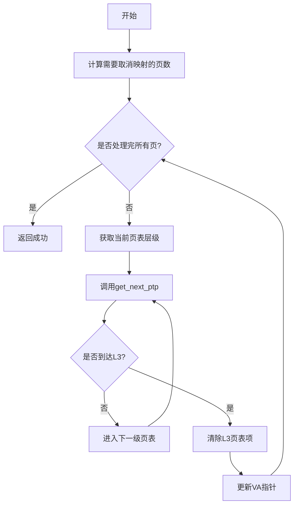

1. 接下来分析大页映射相关函数(map_range_in_pgtbl_huge/unmap_range_in_pgtbl_huge)
2. 需要重点关注：
   - 2MB大页与4KB普通页的区别
   - 大页映射的页表项设置(set_pte_flags_huge)
   - 地址对齐和块大小处理
3. 需要结合BLOCK_SHIFT和SIZE_2M等宏定义理解

### 8. map_range_in_pgtbl_huge 函数

**功能**：建立2MB大页的内存映射

**代码解释**：

- 参数：

  - pgtbl: 页表根指针
  - va: 起始虚拟地址
  - pa: 起始物理地址
  - len: 映射长度
  - flags: 内存属性标志
- 关键逻辑：

  1. 按2MB块大小循环处理
  2. 在L2页表直接创建块映射项
  3. 使用set_pte_flags_huge设置大页属性
  4. 相比普通页映射减少页表层级

**Mermaid流程图**：

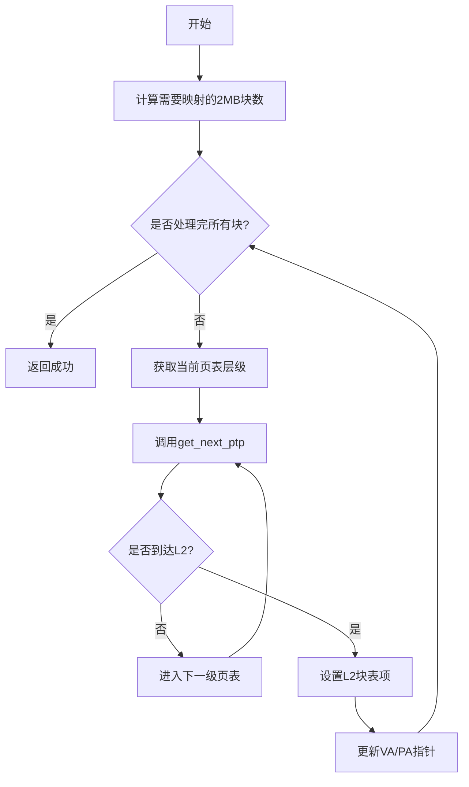

### 9. unmap_range_in_pgtbl_huge 函数

**功能**：解除2MB大页的内存映射

**代码解释**：

- 参数：

  - pgtbl: 页表根指针
  - va: 起始虚拟地址
  - len: 取消映射长度
- 关键逻辑：

  1. 按2MB块大小循环处理
  2. 在L2页表清除块映射项
  3. 相比普通页取消映射处理更高效

**Mermaid流程图**：

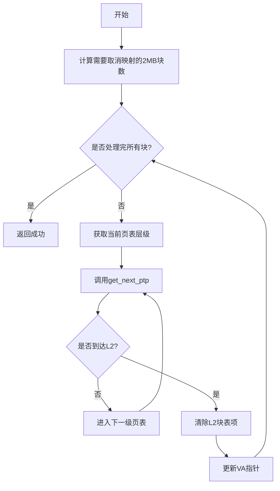

### 页表模块整体架构分析与总结

#### 1. 模块架构概览

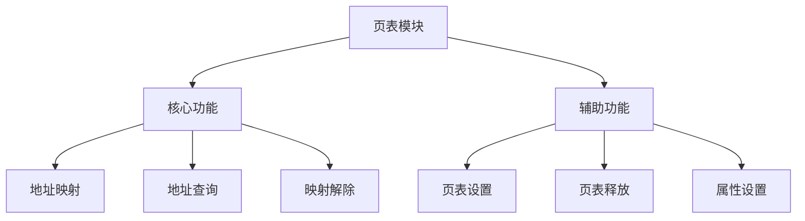

#### 2. 关键设计特点

1. **四级页表结构**：

   - L0-L3级页表，支持48位虚拟地址空间
   - 通过GET_Lx_INDEX宏实现地址分解
2. **双模式映射**：

   - 普通页(4KB)：使用L3页表项
   - 大页(2MB)：使用L2块表项
3. **内存属性控制**：

   - 通过set_pte_flags/set_pte_flags_huge设置
   - 支持多种内存类型(NORMAL/DEVICE/NOCACHE)
4. **惰性分配策略**：

   - get_next_ptp实现按需分配页表页
   - 减少内存占用

#### 3. 核心函数交互关系

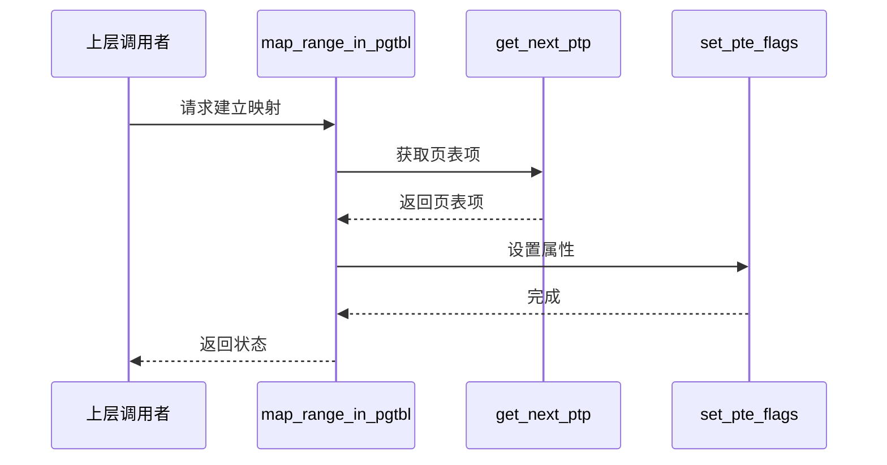

#### 4. 性能优化点

1. **大页映射**：

   - 减少TLB miss
   - 降低页表内存占用
2. **批处理操作**：

   - map/unmap_range系列函数支持范围操作
   - 减少重复遍历页表开销
3. **缓存友好设计**：

   - 页表页按4KB对齐
   - 结构体紧凑布局

#### 5. 关键数据结构

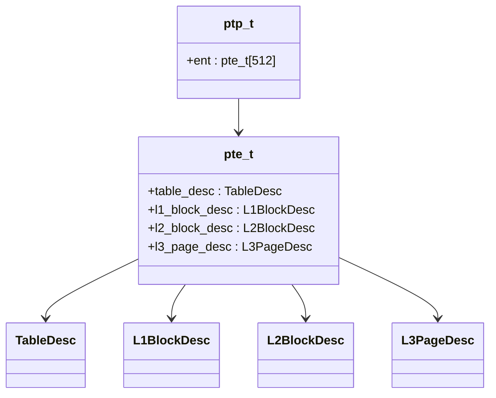

#### 6. 异常处理机制

1. **错误码规范**：

   - ENOMAPPING: 地址未映射
   - 其他错误通过BUG_ON捕获
2. **健壮性检查**：

   - 无效指针检测
   - 页表项有效性验证

#### 7. 测试验证

1. **测试用例覆盖**：

   - 单页映射/取消映射
   - 多页连续映射
   - 大范围映射(含大页)
   - 内存占用检查
2. **自动化测试**：

   - 通过CHCORE_KERNEL_TEST宏控制
   - 集成到实验室测试框架

#### 8. 改进建议

1. **功能扩展**：

   - 支持更多大页尺寸(1GB)
   - 添加页表统计信息
2. **性能优化**：

   - 预分配页表页
   - 批量TLB刷新
3. **安全增强**：

   - 页表写保护
   - 权限细粒度控制

需要我将这个总结写入Markdown文件吗？或者您希望对某些部分进行更深入的分析？
