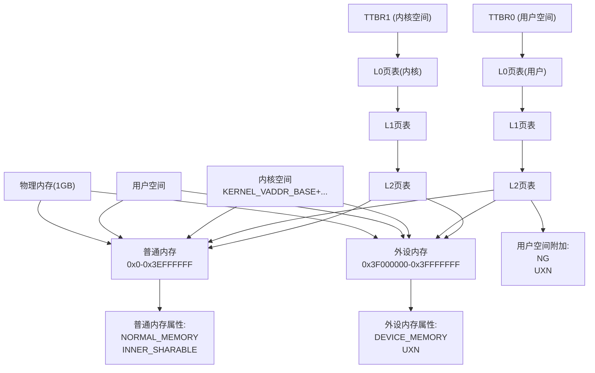

# 树莓派3B MMU内存映射图

## 关键说明
1. **三级页表结构**:
   - L0: 顶级页表，由TTBR0/TTBR1指向
   - L1: 中间级页表
   - L2: 最终级页表，包含实际物理页映射

2. **内存区域划分**:
   - 普通内存: 0x00000000-0x3EFFFFFF (992MB)
   - 外设内存: 0x3F000000-0x3FFFFFFF (16MB)

3. **映射特性**:
   - 用户空间(TTBR0): 直接映射，附加NG和UXN属性
   - 内核空间(TTBR1): 高位地址映射，共享相同物理内存

4. **内存属性**:
   - 普通内存: 可缓存、内部共享
   - 外设内存: 设备内存、不可执行