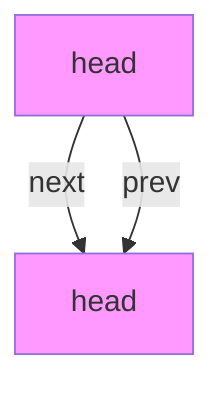
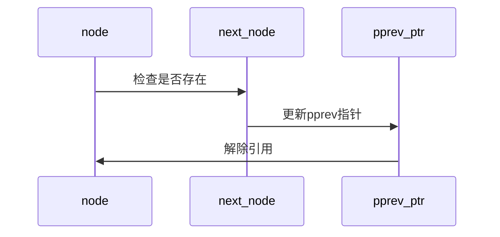

# ArmDax9OS链表实现详解

[原有内容保持不变...]

## 补充图表

### list_empty函数
```c
static inline int list_empty(struct list_head *head) {
    return head->next == head;
}
```



### hlist_del函数
```c
static inline void hlist_del(struct hlist_node *node) {
    if (node->next)
        node->next->pprev = node->pprev;
    *node->pprev = node->next;
}
```



### hlist_empty函数
```c
static inline int hlist_empty(struct hlist_head *head) {
    return head->next == NULL;
}
```

```mermaid
graph LR
    A[head] -->|next| B(NULL)
    style A fill:#9f9
