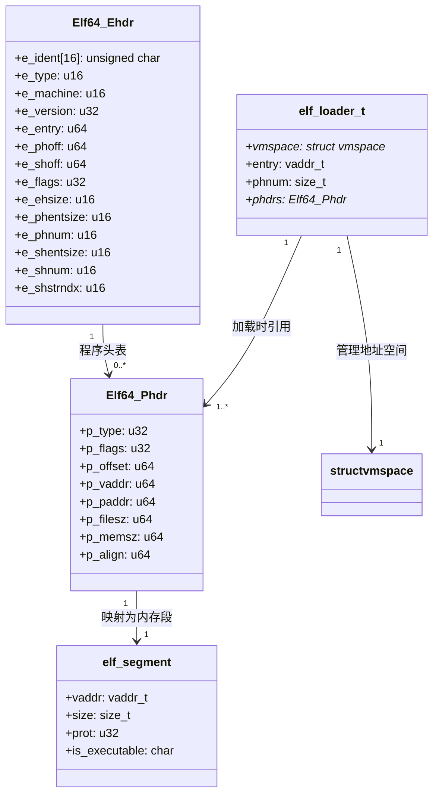
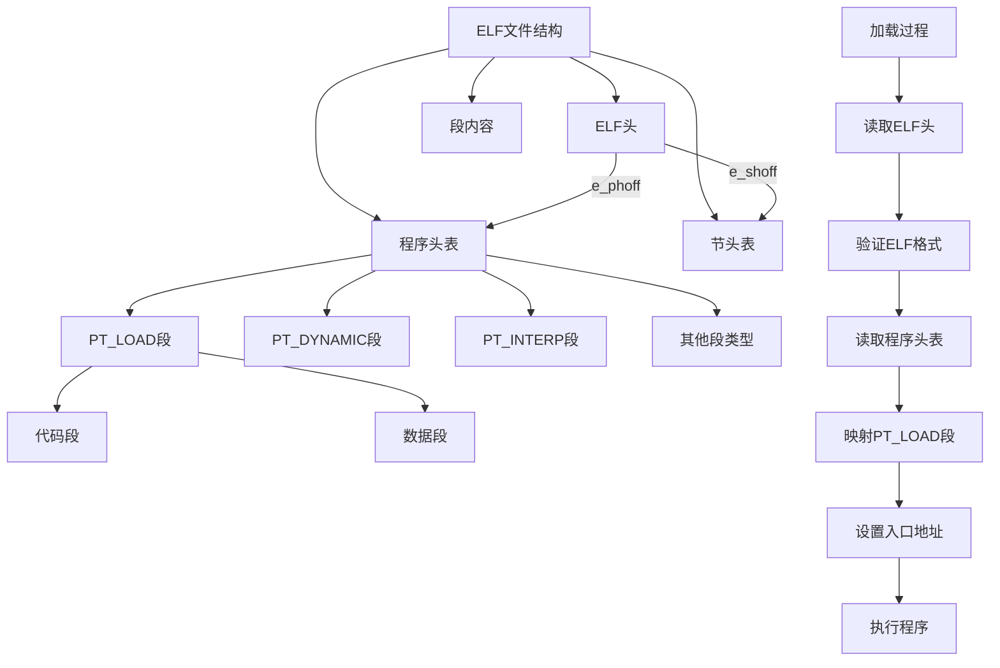

1. 首先分析提供的elf.h文件内容，它定义了ELF(Executable and Linkable Format)文件格式的关键数据结构
2. 主要数据结构包括：
   - Elf64_Ehdr: ELF文件头结构
   - Elf64_Phdr: 程序头表项结构
   - elf_loader_t: ELF加载器状态
   - elf_segment: ELF段映射信息
3. 需要展示ELF文件的整体结构，包括：
   - ELF文件头
   - 程序头表
   - 节头表
   - 各段内容
4. 使用Mermaid图表可以清晰地展示这些结构之间的关系
5. 还需要展示ELF加载过程中的关键数据结构关系

我将使用Mermaid绘制ELF文件结构和加载过程的图表：

这个图表展示了：
1. ELF文件的整体结构，包括文件头、程序头表和节头表
2. 关键数据结构之间的关系
3. ELF加载过程的主要步骤

您对这个结构图是否满意？如果需要任何调整或补充，请告诉我。